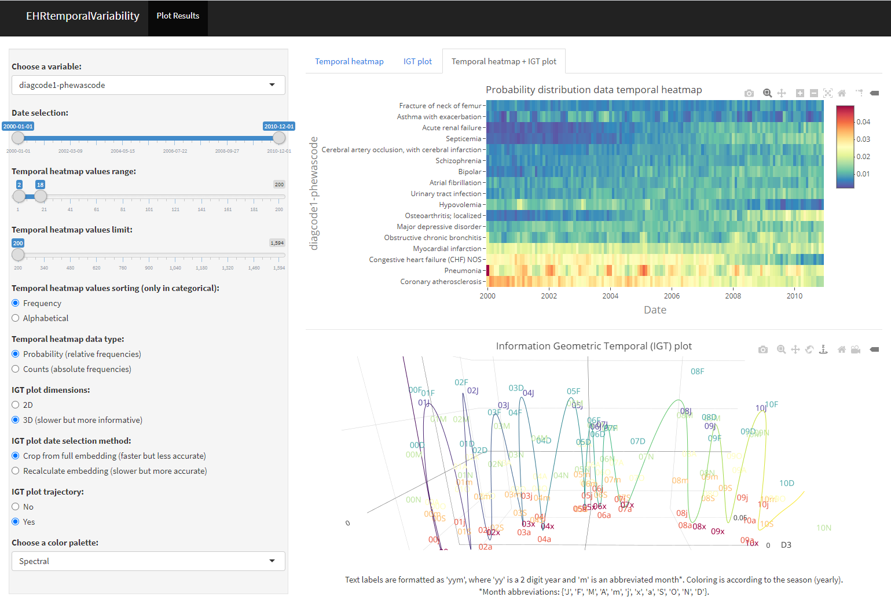

# EHRtemporalVariability-shiny

`EHRtemporalVariability-shiny` is an R Shiny app for delineating temporal dataset shifts in Eletronic Health Records. This app uses and complements the R `EHRtemporalVariability` package (https://github.com/hms-dbmi/EHRtemporalVariability).

## What is this repository for?

Functions to delineate temporal dataset shifts in Electronic Health Records through the projection and visualization of dissimilarities among data temporal batches. This is done through the estimation of data statistical distributions over time and their projection in non-parametric statistical manifolds, uncovering the patterns of the data latent temporal variability. Dataset shifts can be explored and identified through visual analytics formats such as Data Temporal Heatmaps (DTHs) and Information Geometric Temporal (IGT) plots [1-3](https://github.com/hms-dbmi/EHRtemporalVariability#Citation). An additional [EHRtemporalVariability Shiny app](https://github.com/hms-dbmi/EHRtemporalVariability-shiny) can be used to load and explore the package results and even to allow the use of these functions to those users non-experienced in R coding.

*Screenshot of the EHRtemporalVariability Shiny app analyzing the variable 'Diagnosis Code #1 - PheWAS Code' of the [NHDS](https://www.cdc.gov/nchs/nhds/) data*

Note that there are two shiny app R files:

* __EHRtemporalVariabilityShinyAppForLocalUse.R__: Besides the embedded demo and the loading of .RData files, it includes the loading and processing of csv files with raw data at individual level.
* __EHRtemporalVariabilityShinyAppForPublicUse.R__: It does not include the csv functionality.

## On line demo

An on line demo of the EHRtemporalVariability shiny app is available at http://ehrtemporalvariability.upv.es/

## Package Status

* __Version__: 1.1.1
* __Authors__: Carlos Sáez (UPV-HMS), Alba Gutiérrez-Sacristán (HMS), Isaac Kohane (HMS), Juan M García-Gómez (UPV), Paul Avillach (HMS)
* __Maintainer__: Carlos Sáez (UPV-HMS)
 
Copyright: 2019 - Biomedical Data Science Lab, Universitat Politècnica de València, Spain (UPV) - Department of Biomedical Informatics, Harvard Medical School (HMS)

## Documentation

* Vignette: [EHRtemporalVariability: Delineating temporal dataset shifts in electronic health records](http://personales.upv.es/carsaesi/EHRtemporalVariability/EHRtemporalVariability.html)

* [Package help](https://github.com/hms-dbmi/EHRtemporalVariability/raw/master/vignettes/EHRtemporalVariabilityHelp.pdf)

## Publication
The code in this repository is part of the work presented in: "EHRtemporalVariability: delineating temporal data-set shifts in electronic health records" https://academic.oup.com/gigascience/article/9/8/giaa079/5878826

## Citation

If you use EHRtemporalVariability, please cite:

Sáez C, Gutiérrez-Sacristán A, Kohane I, García-Gómez JM, Avillach P. EHRtemporalVariability: delineating temporal dataset shifts in electronic health records. Preprint submitted to medRxiv. https://doi.org/10.1101/2020.04.07.20056564

Consider also citing any of the original methods and case studies describing the approach:

[1]: Sáez C, Rodrigues PP, Gama J, Robles M, García-Gómez JM. Probabilistic change detection and visualization methods for the assessment of temporal stability in biomedical data quality. Data Mining and Knowledge Discovery. 2015;29:950-75. https://doi.org/10.1007/s10618-014-0378-6

[2]: Sáez C, Zurriaga O, P?rez-Panad?s J, Melchor I, Robles M, García-Gómez JM. Applying probabilistic temporal and multisite data quality control methods to a public health mortality registry in spain: A systematic approach to quality control of repositories. Journal of the American Medical Informatics Association. 2016;23:1085-95. https://doi.org/10.1093/jamia/ocw010

[3]: Sáez C, García-Gómez JM. Kinematics of Big Biomedical Data to characterize temporal variability and seasonality of data repositories: Functional Data Analysis of data temporal evolution over non-parametric statistical manifolds. International Journal of Medical Informatics. 2018;119:109-24. https://doi.org/10.1016/j.ijmedinf.2018.09.015

